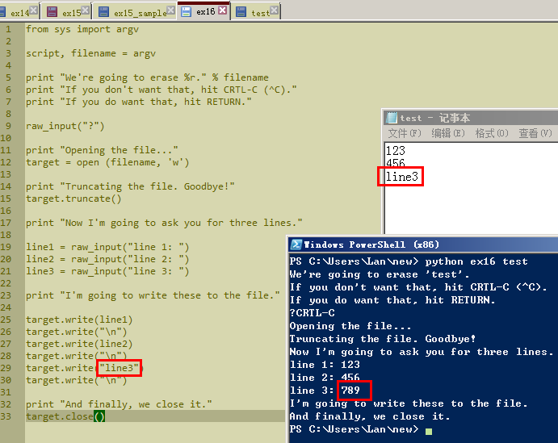
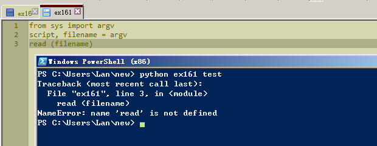
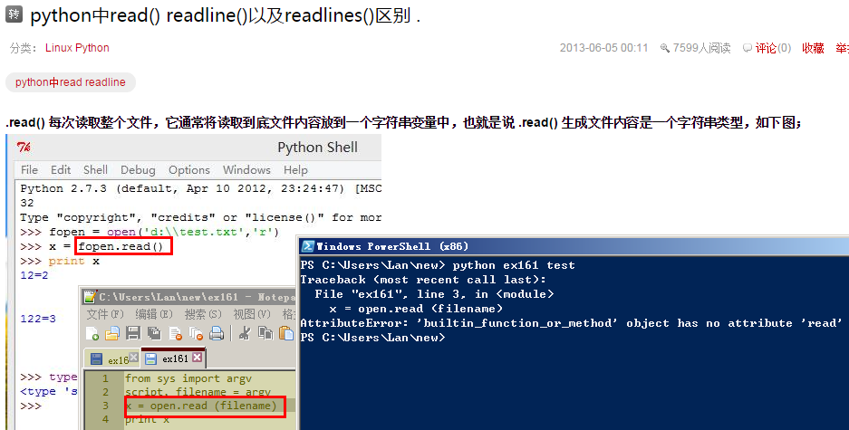

# 习题 16

用python运行ex16后，打开test文件，看到应该是123一行，456一行，789一行。可实际789那行显示内容却是line3。回头检查脚本，发现29行多了个双引号。

## Study Drills

### 2.写一个和上一个练习类似的脚本，使用 read 和 argv 读取你刚才新建的文件。

#### 尝试1 

提示read没有定义。印象中read是个函数，看来是记错了。

#### 尝试2

在百度上python read出一个网页，仿照改了下脚本，运行还是出错了。

#### 尝试3
题目里说“写一个和上一个练习类似的脚本”，倒回到习题15里，仿照着例子改了下脚本，这下运行成功了。!

#### 总结

遇到问题，还是习惯去百度。原因有两点，就是看到英文第一反应就是不想看，第二点就是要翻墙。唉，没错，我到现在还是不会翻墙，还不能熟练使用google。遇到问题要看文档时极度缺乏耐心。

### 3.文件中重复的地方太多了。试着用一个 target.write() 将 line1, line2, line3 打印出来，你可以使用字符串、格式化字符、以及转义字符。