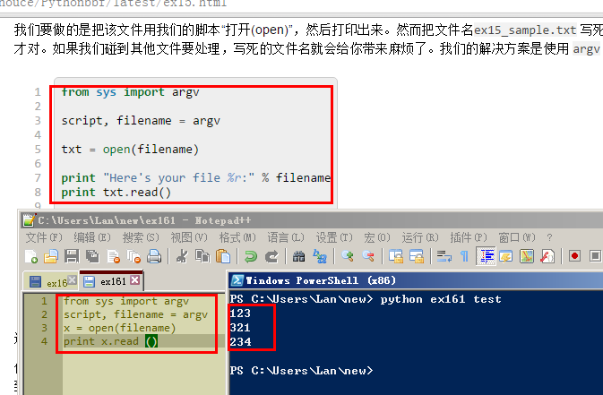
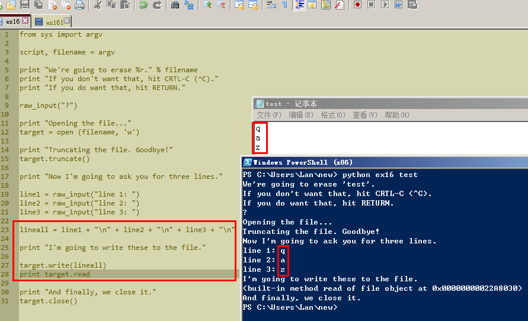
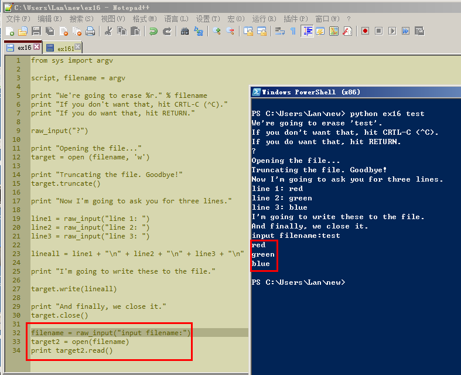
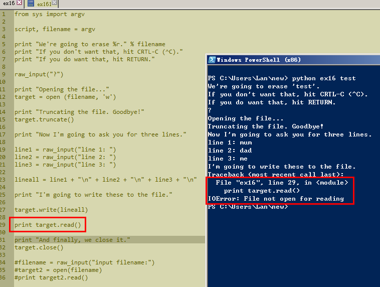

# 习题 16

日期20151118

用python运行ex16后，打开test文件，看到应该是123一行，456一行，789一行。可实际789那行显示内容却是line3。回头检查脚本，发现29行多了个双引号。

## Study Drills

### 2.写一个和上一个练习类似的脚本，使用 read 和 argv 读取你刚才新建的文件。

#### 尝试1 

提示read没有定义。印象中read是个函数，看来是记错了。

#### 尝试2

在百度上python read出一个网页，仿照改了下脚本，运行还是出错了。

#### 尝试3
题目里说“写一个和上一个练习类似的脚本”，倒回到习题15里，仿照着例子改了下脚本，这下运行成功了。!

#### 总结

遇到问题，还是习惯去百度。原因有两点，就是看到英文第一反应就是不想看，第二点就是要翻墙。唉，没错，我到现在还是不会翻墙，还不能熟练使用google。遇到问题要看文档时极度缺乏耐心。

### 3.文件中重复的地方太多了。试着用一个 target.write() 将 line1, line2, line3 打印出来，你可以使用字符串、格式化字符、以及转义字符。

#### 尝试1

test内容改写成功，但是没有在Powershell里打印出来。

上图里print target.read后面其实还少了括号。但是加上括号再运行，PowerShell也并没有把test里的内容给打印出来。

#### 尝试2
加分练习2里的实现过程就是，令一个变量等于open一个文件，然后再print这个变量.read。代码写出来就是下图红框里的内容。尝试2和尝试1中间其实还试过很多其他代码，但是只有下图中的才成功了。之前试的总是想直接print target.read()，但是就是不成功。

直接print target.read()的效果就是下图这样的，提示说29行出错了，文件没打开。但是原例子里的32行明明就是在说关闭target，怎么是没打开呢？虽然还是有点想不明白，不过已经做成功运行过代码一次，先放放，接着往后学。

### 3.找出为什么我们需要给 open 多赋予一个 'w' 参数。提示： open 对于文件的写入操作态度是安全第一，所以你只有特别指定以后，它才会进行写入操作。

