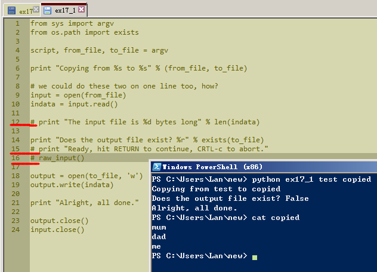
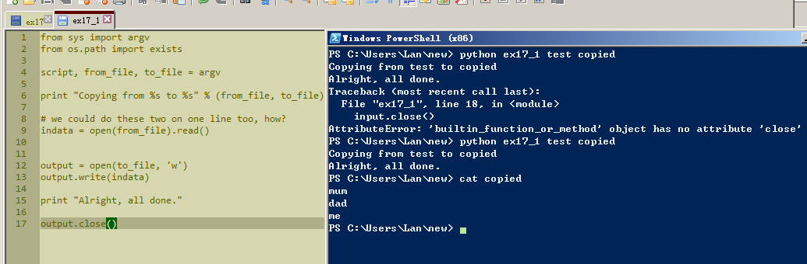
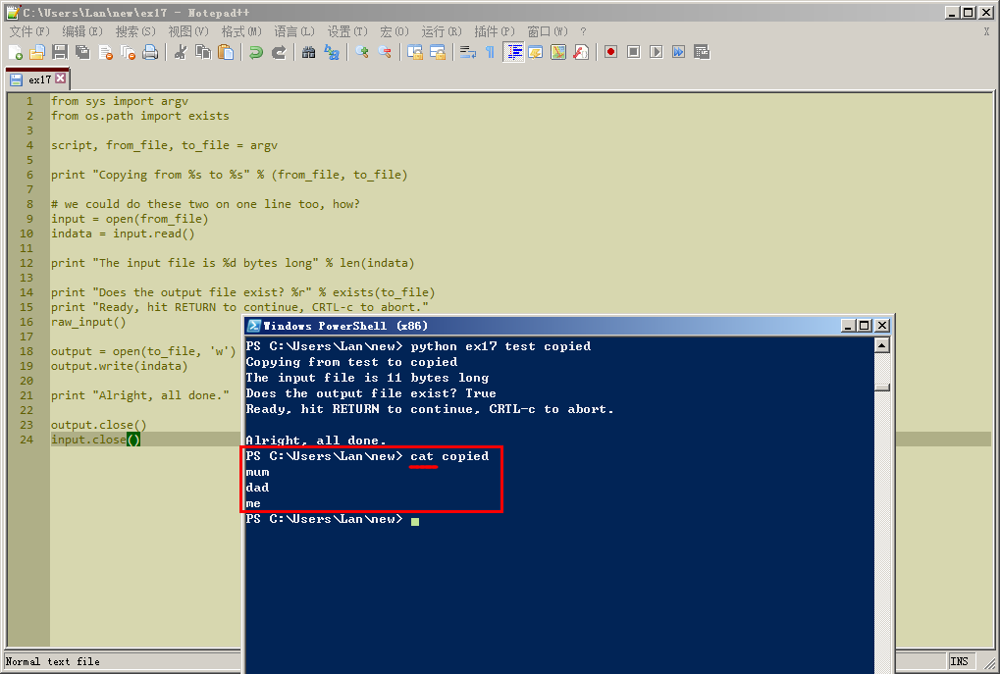

# 习题 17

## Study Drills

### 1.再多读读和 import 相关的材料，将 python 运行起来，试试这一条命令。试着看看自己能不能摸出点门道，当然了，即使弄不明白也没关系。

答：这个先过一过，不管了。

### 2.这个脚本实在有点烦人。没必要在拷贝之前问一遍把，没必要在屏幕上输出那么多东西。试着删掉脚本的一些功能，让它使用起来更加友好。

答：删掉了12、15、16行后，运行的结果如下。

### 3.看看你能把这个脚本改多短，我可以把它写成一行。

答：

#### 尝试1
第9行是把input = open(from_file)和indata = input.read()进行合并后的句子。有点类似数学里，a=b+c,b=d+f，直接拿掉b，用d和f代替。忘了这叫什么做法了。

### 4.我使用了一个叫cat的东西，这个古老的命令的用处是将两个文件“连接(con*cat*enate)”到一起，不过实际上它最大的用途是打印文件内容到屏幕上。你可以通过 man cat 命令了解到更多信息。

### 5.使用 Windows 的同学，你们可以给自己找一个 cat 的替代品。关于 man 的东西就别想太多了，Windows 下没这个命令。

答：1.好像在windows下，cat是可以用的啊。在PowerShell里输入cat，也把test copied里的内容打印出来了。如下图所示。2.找cat的替代品，这个先过。如果是用代码实现打印的过程，昨天已经成功试过了。

### 6.找出为什么你需要在代码中写 output.close() 。

